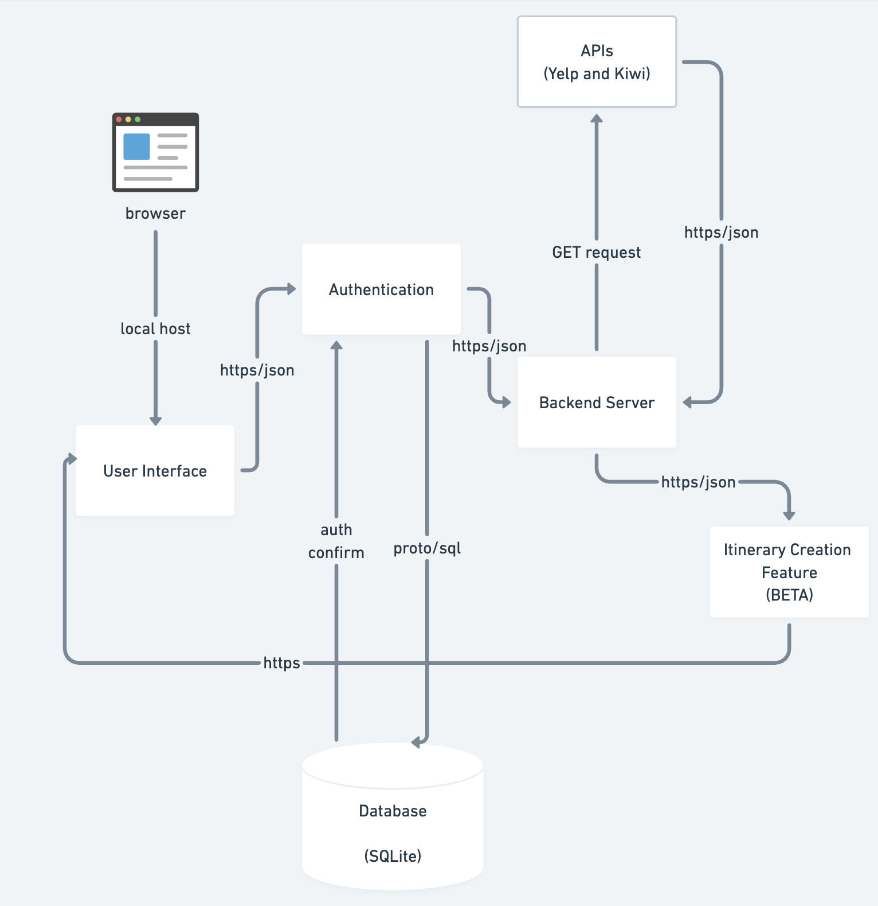
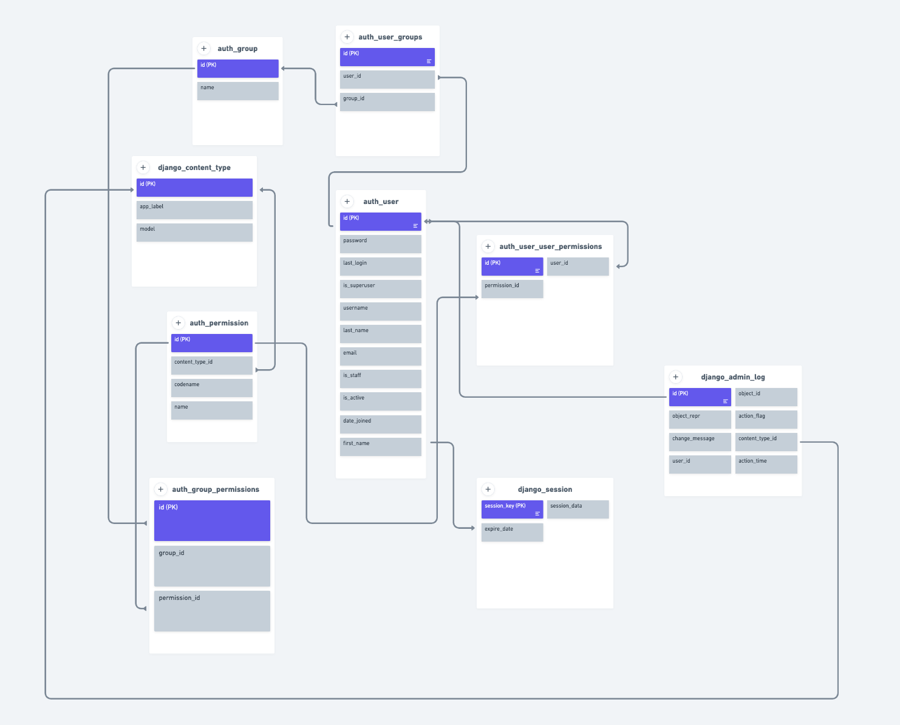
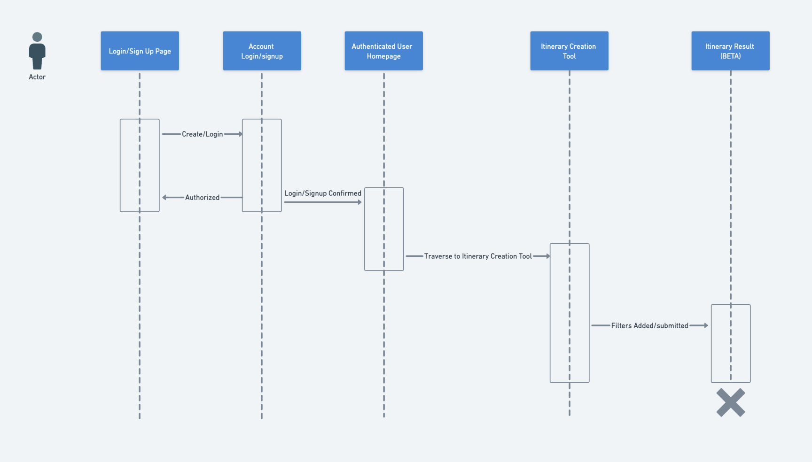

# Nawayfarer Architecture

## 1) High-level Component Diagram 

This segment of the documentation regards the High-Level Component Diagram of NAwayfarer as of 11/13/2023
This is just a BETA of our application, please bare in mind it is still quite basic.

Summary of the High-level Component Diagram:

The browser is acting as a user interface where the user will interact with the application. Since we are running this locally (not set up on cloud yet), the UI is connected by a local development server. The user interface allows users to login through the use of our authentication on the application. The user info is confirmed and authentication is complete. With that, the application uses the backend to call (from views) our APIs through a GET request; the API's are the Yelp and Kiwi API as of now.

NOTE: soon it will include OpenAI's API as well, but as mentioned before, this is still IN BETA. 

The API results are then returned to the backend, and then used in the beta version of our itinerary creation, where the results are now displayed (both flight information and hotel information of an area). The result is of course displayed in the user interface, where users will be able to look at the result that was brought up by the itinerary creation tool.

NOTE: This will still be updated, as our results have yet to be stored, and we have yet to fully create a real itinerary for users. Additionally, we are planning to use at least one more API to complete our application. 

## 2) Entity Relationship (ER) Diagram of Login and Authentication 

This segment of the documentation regards the ER diagram of the tables relating to authentication.

In our authentication system on Django (key part of the application), the 'auth_user' table holds all user data (username, passwords, etc.) users can be in auth_group, with their association tracked through the 'auth_user_groups' table. Permissions (although not fully used yet) are assignable both to users and groups. 'auth_user_user_permissions' and 'auth_group_permissions' give the connection between users/groups and permissions. The 'django_session' table tracks users sessions, but does NOT have a foreign key relation. However, it is generally connected (hence the arrow not pointing specifically to an attribute). 'django_content_type' gives permissions relating to specific content types within out application, and 'django_admin_log' logs admin actions, and is linked to 'auth_user' and 'django_content_type'. All of these tables are used for administration and assist in the authentication process of this application. Note that all of this was taken directly from our DB file in the directory. Also note there are more tables than just these.

## 3) Itinerary Creation(BETA) Flow Diagram

This segment of the documentation regards the Flow Diagram of the Itinerary Creation feature we have implemented as of now.

This flow diagram represents the user interaction with our system, beginning with the login/sign-up page to gain access to the travel itinerary feature. Once the user is created and/or logged in, the user can go to the itinerary creation tool. In the itinerary creation tool, the user can fill in their desired filters or preferences for their itinerary! Once the user submits their filter details, the itinerary result, which will for now only show a BETA version, is generated for the user. This marks the end of the user's flow, beginning from authentication to getting a BETA version of an itinerary based on their desired filter inputs.

DATE: Updated as of 11/13/2023